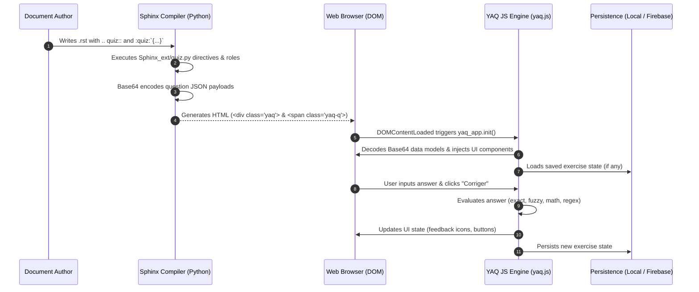

# Sphinx Interactive Exercises Documentation

This repository contains a Sphinx documentation extension designed to embed interactive exercises and self-assessment quizzes into HTML documentation generated by Sphinx.

The project is structured into two main components:
1. **Python Sphinx Extension (`Sphinx_ext`)**: A lightweight wrapper written in Python that defines custom reStructuredText (reST) directives and roles to encode exercise configurations directly within Sphinx documents.
2. **JavaScript Library (`YAQ` / `yaq.js`)**: A feature-rich client-side JavaScript engine that parses encoded exercise markup, builds interactive UI components, processes user answers (with support for fuzzy matching, math expression evaluation, and sequences), and handles state persistence (local or Firebase cloud storage).

---

## High-Level Architecture

The diagram below illustrates how an exercise defined in reStructuredText source code is processed during the Sphinx build phase and subsequently rendered and managed in the client's web browser:

---

## Documentation Structure

For detailed technical specifications and authoring guidelines, refer to the following documentation files:

- 🐍 **[Python Extension Documentation](python_extension.md)**  
  Technical details of `Sphinx_ext/quiz.py`, including node definitions, custom directives (`.. quiz::`, `.. spoiler::`), inline roles (`:quiz:`, `:spoiler:`), and Sphinx extension lifecycle integration.

- ⚡ **[JavaScript Library Documentation](javascript_library.md)**  
  In-depth technical breakdown of `yaq.js`, covering component architecture, reactive data binding via `watch.js`, question engines (`TF`, `FB`, `SC`), math parsing (`math.js`), fuzzy string comparison (Levenshtein distance), and the `PersistenceWidget` (LocalStorage & Firebase cloud sync).

- ✍️ **[Authoring & Usage Guide](usage_guide.md)**  
  A practical guide for documentation authors detailing reST markup syntax, complete JSON schema specifications for all question types, spoiler blocks, and internationalization (`i18n`) configuration.

- 🔍 **[Code Review & Improvement Roadmap](code_review.md)**  
  Detailed analysis of critical bugs, security considerations, architectural issues, accessibility gaps, and modernization recommendations.

