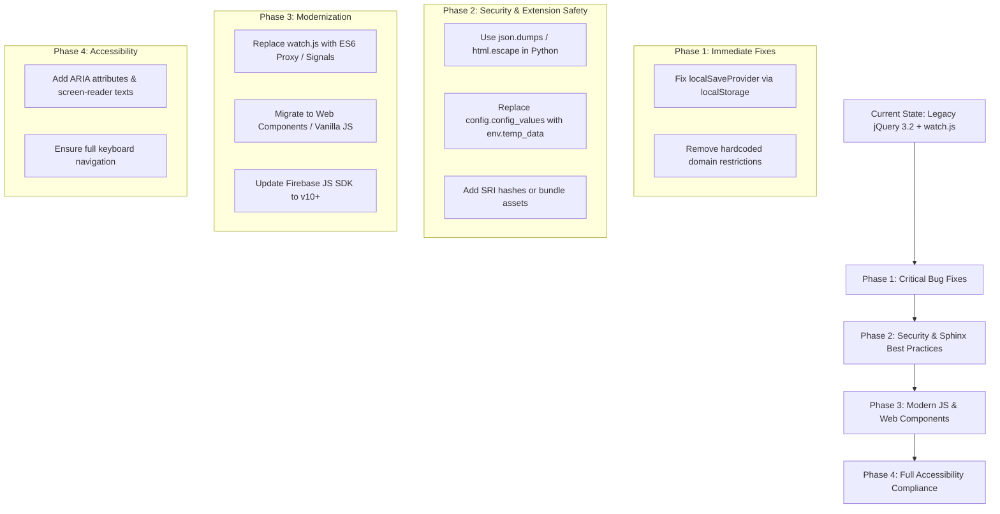

# Code Review & Potential Improvements

This document outlines a technical review of the Sphinx Interactive Exercises extension (`Sphinx_ext/quiz.py`) and the associated JavaScript library (`yaq.js`), highlighting critical bugs, security risks, architectural flaws, accessibility gaps, and recommended improvements.

---

## 1. Critical Bugs & Broken Features

### 🔴 Broken Local Storage Persistence
- **Location**: [`source/Sphinx_ext/_static/yaq.js` (lines 120-163)](file:///c:/Users/perre/Dropbox/cours/demoSphinx/source/Sphinx_ext/_static/yaq.js#L120-L163)
- **Problem**: The `localSaveProvider.save()` and `localSaveProvider.load()` functions have their `Cookies.set(...)` and `Cookies.get(...)` calls commented out.
- **Impact**: When cloud/Firebase save is disabled (`deactivateFirebase = true`) or when users choose "Continue without saving", exercise state is **never persisted**. Reloading or navigating away clears all answers.
- **Fix**: Re-enable local storage persistence using modern `window.localStorage` API instead of cookies.

---

## 2. Security & Input Sanitization Vulnerabilities

### ⚠️ Manual HTML & Attribute Escaping in Python Extension
- **Location**: [`source/Sphinx_ext/quiz.py` (lines 67-68)](file:///c:/Users/perre/Dropbox/cours/demoSphinx/source/Sphinx_ext/quiz.py#L67-L68)
- **Problem**: The quiz node visitor formats HTML attributes manually via `.replace("'","&#39;").replace('"','\\"').
- **Impact**: If a title contains backslashes, HTML entities, or special characters, it can corrupt the `data-model` JSON string attribute or cause attribute injection vulnerabilities.
- **Fix**: Use `json.dumps()` and standard Python `html.escape()` for building attribute strings.

### ⚠️ Fragile String Slicing in Role Parsing
- **Location**: [`source/Sphinx_ext/quiz.py` (line 17)](file:///c:/Users/perre/Dropbox/cours/demoSphinx/source/Sphinx_ext/quiz.py#L17)
- **Problem**: `cont = node["content"][7:-1]` assumes the role string always begins with exactly 7 characters (`:quiz:\``).
- **Impact**: If raw text format varies or whitespace is introduced, slicing fails or corrupts the JSON string prior to Base64 encoding.
- **Fix**: Use string pattern matching or extract the inner text clean from the docutils node text.

### ⚠️ Unpinned External CDN Dependencies
- **Location**: [`source/Sphinx_ext/quiz.py` (lines 227-234)](file:///c:/Users/perre/Dropbox/cours/demoSphinx/source/Sphinx_ext/quiz.py#L227-L234)
- **Problem**: Firebase scripts and styles are loaded over external HTTP CDNs without Subresource Integrity (`integrity="..."`) SRI hashes.
- **Fix**: Bundle assets locally or supply SRI hashes to prevent Supply Chain injection attacks.

---

## 3. Architecture & Code Quality Flaws

### 🟠 Global Sphinx Configuration Mutation
- **Location**: [`source/Sphinx_ext/quiz.py` (lines 102, 109, 161, 173)](file:///c:/Users/perre/Dropbox/cours/demoSphinx/source/Sphinx_ext/quiz.py#L102)
- **Problem**: The directives mutate `config.config_values['quiz_running'] = True` to prevent directive nesting.
- **Impact**: `config.config_values` is Sphinx's global configuration registry. Mutating it during document parsing causes thread-safety issues during parallel builds (`sphinx-build -j`) and pollutes Sphinx runtime state.
- **Fix**: Store transient directive state in `env.temp_data['quiz_running']`.

### 🟠 Hardcoded Institutional Domain
- **Location**: [`source/Sphinx_ext/_static/yaq.js` (line 393)](file:///c:/Users/perre/Dropbox/cours/demoSphinx/source/Sphinx_ext/_static/yaq.js#L393)
- **Problem**: `if(!user.email.endsWith('esiee.fr'))` restricts Firebase authentication strictly to `@esiee.fr` emails inside the core library code.
- **Fix**: Move allowed domain patterns to a configurable option array (e.g., `options.allowedDomains = ["esiee.fr"]`).

### 🟠 Unsafe Math Variable Random Sampling
- **Location**: [`source/Sphinx_ext/_static/yaq.js` (lines 724-738)](file:///c:/Users/perre/Dropbox/cours/demoSphinx/source/Sphinx_ext/_static/yaq.js#L724-L738)
- **Problem**: Mathematical expression evaluation samples random uniform floats without domain checks.
- **Impact**: Functions like `1/x`, `sqrt(x)`, or `log(x)` can sample illegal domain inputs (like `0` or negative values), throwing runtime exceptions or producing `NaN` results during grading.
- **Fix**: Wrap evaluation in `try/catch`, filter out invalid/NaN points, or allow domain restriction bounds.

### 🟠 Global Prototype Mutation
- **Location**: [`source/Sphinx_ext/_static/yaq.js` (lines 1734-1740)](file:///c:/Users/perre/Dropbox/cours/demoSphinx/source/Sphinx_ext/_static/yaq.js#L1734-L1740)
- **Problem**: `delete math.Unit.UNITS[letter];` mutates global `math.js` unit definitions.
- **Fix**: Configure `math.js` instance options locally or use a custom math evaluation scope instead of deleting global unit definitions.

---

## 4. Accessibility (a11y) & UX Gaps

| Element | Current Implementation | Accessibility Issue | Recommended Fix |
| :--- | :--- | :--- | :--- |
| **Interactive Buttons** | `` | Not focusable, missing keyboard events (`Enter`/`Space`). | Use `<button type="button">` or add `role="button"` and `tabindex="0"`. |
| **Inline Spoilers** | `` | Completely inaccessible to keyboard navigation and screen readers. | Add `tabindex="0"`, `role="button"`, `aria-expanded`, and keyboard event handlers. |
| **Feedback Icons** | `<i class="fa fa-thumbs-up">` | Screen readers ignore visual icons. | Add `aria-label="Correct answer"` or visually hidden ``. |
| **Form Inputs** | `<input type="text">` | Inputs lack associated `<label>` or `aria-label`. | Generate unique IDs and associate aria labels describing the question. |

---

## 5. Modernization Roadmap & Recommendations

### Proposed Action Items
1. **Fix Local Storage Persistence**: Replace commented-out cookie code in `localSaveProvider` with `window.localStorage.setItem()` and `getItem()`.
2. **Refactor Python HTML Generators**: Use `json.dumps()` and `html.escape()` for encoding node data attributes safely in `Sphinx_ext/quiz.py`.
3. **Use Sphinx `env.temp_data`**: Replace `config.config_values['quiz_running']` with `env.temp_data['quiz_running']` for clean thread-safe directive parsing.
4. **Upgrade & Decouple Dependencies**: Replace `watch.js` with ES6 `Proxy` / native reactive state, and allow configurable email domain lists for Firebase auth.
5. **Accessibility Overhaul**: Add proper keyboard handlers (`Enter`/`Space`), ARIA attributes (`aria-live`, `aria-label`, `role="button"`), and semantic tags (`<button>`, `<label>`).
