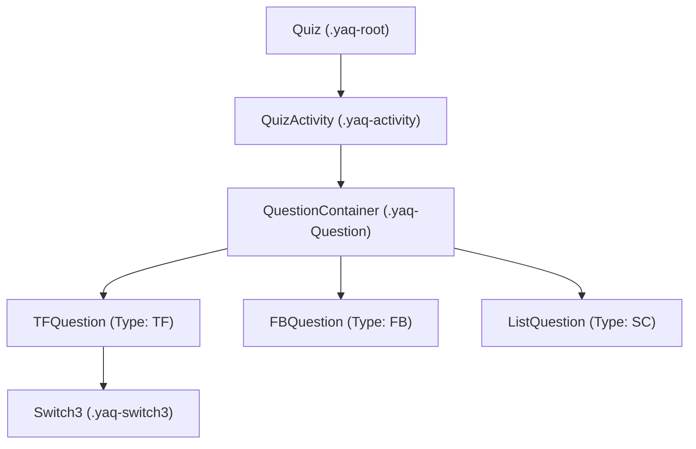
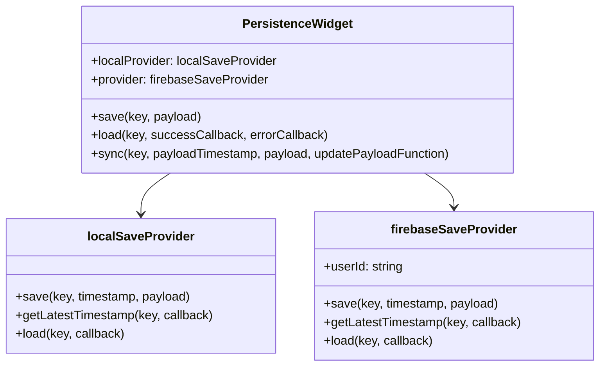

# JavaScript Library Documentation (`yaq.js`)

The `YAQ` (Yet Another Quiz) JavaScript library is located at [`source/Sphinx_ext/_static/yaq.js`](file:///c:/Users/perre/Dropbox/cours/demoSphinx/source/Sphinx_ext/_static/yaq.js). It powers all interactive features, state management, answer evaluation algorithms, and persistent storage.

---

## Module Overview & Lifecycle

The library is encapsulated within an IIFE exporting the `yaq_app` global namespace:

```javascript
var yaq_app = (function() {
    var self = {};
    // ... internal classes and methods
    return self;
})();

document.addEventListener("DOMContentLoaded", function() {
    yaq_app.init();
});
```

### Startup Sequence (`yaq_app.init()`)

1. **Unit Cleanup**: On `DOMContentLoaded`, single-letter unit definitions (`a`-`z`, `A`-`Z`) are removed from `math.Unit.UNITS` to avoid ambiguous variable evaluation conflicts in `math.js`.
2. **Persistence Initialization**: Instantiates `PersistenceWidget` to set up state storage.
3. **DOM Scanning**: Searches for all DOM elements with the `.yaq` class.
4. **Model Parsing**: Reads the `data-model` JSON attribute on each `.yaq` element, extracts inner HTML markup, clears the placeholder container, and instantiates a `Quiz` object.
5. **Event Binding**: Registers a `window.onunload` listener to flush any pending persistence saves.

---

## Reactivity & State Management

YAQ relies on **`watch.js`** for property observation. Component views subscribe to model properties and automatically update their DOM elements when properties change:

```javascript
watch(this.model, ["selectedIndex"], this.__updateSelection.bind(this));
watch(this.model, "state", this.__updateState.bind(this));
```

### Enumerations

#### 1. `QuestionStateEnum`
Bitmask representing the state of an individual question:
- `unsolved` (`1`): Unanswered or modified.
- `correct` (`2`): Correctly answered.
- `wrong` (`4`): Incorrectly answered.
- `solved` (`8`): Solution revealed by user.

#### 2. `ActivityStateEnum`
Bitmask representing the state of an entire exercise/quiz activity:
- `ongoing` (`1`): Questions remaining to be answered.
- `solvable` (`2`): All questions answered, but at least one is incorrect (allows showing solution).
- `ended` (`4`): All questions are either correct or solved.

---

## Component Architecture & Hierarchy



---

## Core Component Classes

### 1. `Quiz`
The top-level container for an interactive exercise box.
- **Responsibilities**: Renders header (`Exercice N : Title`), content area, and footer action buttons ("Corriger", "Montrer la solution", "Recommencer").
- **State Logic**: Hides/shows action buttons depending on `ActivityStateEnum`:
  - `ongoing`: Shows "Corriger" (Grade).
  - `solvable`: Shows "Montrer la solution" (Solve).
  - `ended`: Shows "Recommencer" (Reset).
- **Auto-Persistence**: Subscribes to model mutations via `watch(this.model, ...)` and automatically debounces save operations to `PersistenceWidget`.

### 2. `QuizActivity`
Manages the collection of questions inside a quiz.
- **Base64 Decoding**: Locates `.yaq-q` elements and decodes the Base64 UTF-8 JSON payload using `__b64DecodeUnicode(str)`.
- **Aggregate Evaluation**: Listens to state changes across all child `QuestionContainer` objects to compute the overall exercise state (`ongoing`, `solvable`, `ended`).

### 3. `QuestionContainer`
Wraps individual question components and displays contextual feedback icons:
- `wrongMarker`: Red thumbs-down icon (`fa-thumbs-down`).
- `correctMarker`: Green thumbs-up icon (`fa-thumbs-up`).
- `infoMarker`: Blue info icon (`fa-info-circle`) when the solution has been revealed.

---

## Question Engines (`questionConstructors`)

Question types are registered in the `questionConstructors` dictionary.

### 1. True/False (`TFQuestion` — Type `"TF"`)
- **Control Component**: `Switch3` (a 3-state toggle button group: `V` [True], `?` [Unset], `F` [False]).
- **Grading**: Compares selected index (`0` for True, `2` for False) against expected answer `"T"` or `"F"`.

### 2. Single Choice (`ListQuestion` — Type `"SC"`)
- **Control Component**: Standard HTML `<select>` dropdown populated from comma-separated string `values`.
- **Grading**: Compares selected option text against `this.__answer`.

### 3. Fill-In-The-Blank (`FBQuestion` — Type `"FB"`)
- **Control Component**: Text input (`<input type="text">`).
- **Advanced Answer Evaluation Flags**:

| Flag Name | Description & Mechanism |
| :--- | :--- |
| **`fuzzy`** | Calculates string similarity using **Levenshtein edit distance** with a `0.8` threshold after stripping diacritics using the `latinise()` mapping table. |
| **`sequence`** | Splits answers into lists using space, comma, or semicolon delimiters (`[\s,;]+`). By default, item order does not matter. |
| **`ordered`** | Combines with `sequence` to require exact item ordering. |
| **`math`** | Parses mathematical expressions using `math.compile()`. Evaluates expressions at 50 random sample values over ranges defined in `vars`. Compares outputs using relative floating-point equality (`floatEqual` within `1e-8`). Displays warning marker `⚠` with tooltips for syntax/variable errors. |
| **`regex`** | Evaluates user input against a JavaScript regular expression (`RegExp`). |
| *(None)* | Standard strict string or numeric equality. |

---

## Persistence Architecture (`PersistenceWidget`)

`PersistenceWidget` provides persistent state storage and multi-device cloud synchronization.



- **`localSaveProvider`**: Client-side storage provider.
- **`firebaseSaveProvider`**: Integrates with Firebase Realtime Database. Restricts login to specified email domains (e.g. `@esiee.fr`). Stores data under `/users/{uid}/quizz/{key}` and timestamps under `/users/{uid}/times/{key}`.
- **Conflict Resolution (`__sync`)**: Compares timestamp triples (`payloadTimestamp`, `localTimestamp`, `cloudTimestamp`) and updates local or cloud storage with whichever model holds the newest timestamp.
